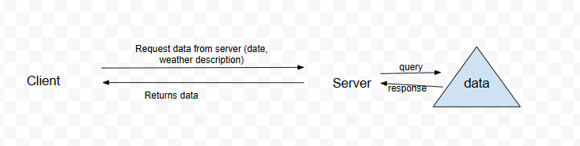
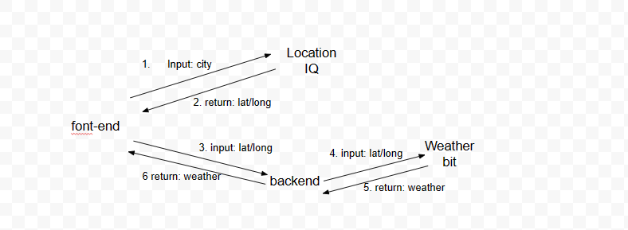

# Project Name

**Author**:Miranda
**Version**: 1.4.0 (increment the patch/fix version number if you make more commits past your first submission)

## Overview

Making a map for a city upon user-request, then generate info regarding the city at-hoc by making API calls.

## Getting Started
<!-- What are the steps that a user must take in order to build this app on their own machine and get it running? -->
Any machine with npm

## Architecture

## Change Log
<!-- Use this area to document the iterative changes made to your application as each feature is successfully implemented. Use time stamps. Here's an example:
03-06-2023 8:11pm - Application now has a fully-functional express server, with a GET route for the location resource. -->

03-06-2023 8:11pm - Application renders a name, latitute and longitude, and a map upon client's request for a city.
03-09-2023 8:11pm - Application fully rendered locally, currengly under testing for remote server. Style added

## Credit and Collaborations
<!-- Give credit (and a link) to other people or resources that helped you build this application. -->
Special thanks to: Sheyna, Justin Hammerly. Daniel Yoon, Krill